***

# Part I.

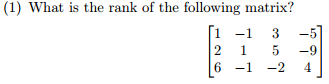

3x4 matrix, so rank = 3

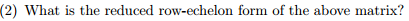

With row reduction we can get:

```{r}
m <- matrix(c(1,0,0,2/55,0,1,0,-14/55,0,0,1,-97/55), byrow = TRUE, ncol = 4)
m
```

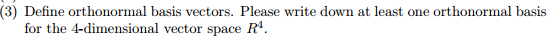

The basic definition is that they are unit vectors that are orthogonal. They must also be non-zero. An example could be:

```{r}
m <- matrix(c(1,0,0,0,0,1,0,0,0,0,1,0,0,0,0,1), byrow = TRUE, ncol = 4)
m
```

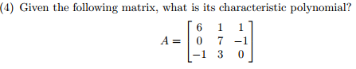

First we solve for the determinant:

$$
det(
\begin{bmatrix}
  6 & 1 & 1 \\
  0 & 7 & -1 \\
  -1 & 3 & 0
\end{bmatrix}
-
\begin{bmatrix}
  \lambda & 0 & 0 \\
  0 & \lambda & 0 \\
  0 & 0 & \lambda
\end{bmatrix}
) = 0
$$

Which will give a characteristic polynomial of:

$$ p(\lambda) = -\lambda^3 + 13\lambda^2 - 46\lambda + 26 $$

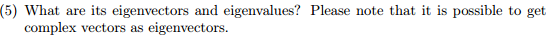

I can get eigenvalues from the process from above and plugging back into the original matrix, or from using R, let's use R.

```{r}
m <- matrix(c(6,1,1,0,7,-1,-1,3,0), byrow = TRUE, ncol = 3)
print(eigen(m))
```

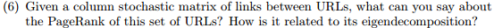

Given that the column is stochastic (randomly determined), and given that PageRank assumes that more popular websites will receive more links, we can then assume that the PageRank for this set of URLs will be fairly random as well. Generally PageRank iterates until a stable result is found, in the case of random input there shouldn't be a stable result, so decomposition will continue to increase powers nearly infinitely, but ultimately the rankings will still be random.

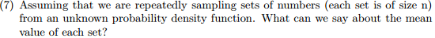

If sampling from a random PDF, the mean values will lead to a normal distribution.

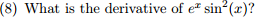

$$ e^x sin(x)(sin(x) + 2cos(x)) $$

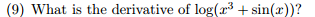

$$ \frac{cos(x) + 3x^2}{sin(x) + x^3} $$

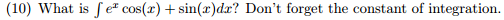

$$ \frac{e^x sin(x) + (e^x - 2) cos(x)}{2} + C $$

***

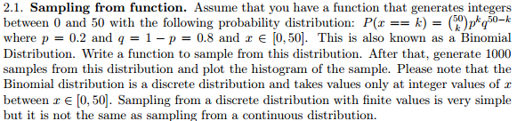

```{r}
boink <- function(v) {
  return (dbinom(v, 50, .2))
}
v <- seq(0,50,1)
x <- boink(v)
sampleme <- sample(v, 1000, TRUE, x)
hist(sampleme)
```

It's normal, hooray!

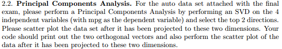

```{r,warning=FALSE}
auto <- read.table("auto-mpg.data", col.names = c("dp", "hp", "wt", "ac", "mpg"))
svd <- prcomp(scale(auto[1:4])) # scale for svd, and do a principal comp analysis
svd$sdev <- svd$sdev^2

# 2 dimensions
d <- diag(svd$sdev)[1:2,1:2]
u <- svd$rotation[,1:2]
v <- svd$rotation[,1:2]
auto_a <- u %*% d %*% t(v)
pairs(~.,cbind(auto_a,auto[5])) # looks a bit off
```

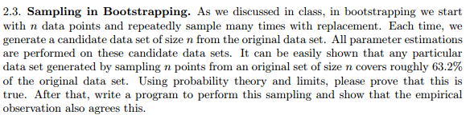

$$ p = 1/n $$
$$ q = 1 - p $$
$$ q_n = (1 - p)^n $$

```{r}
n <- c(1:50)
q <-(1-1/n)^n
answer <- 1-max(q);answer
plot(q)
```

It checks out!

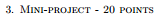

```{r}
# load in
ex3x <- read.table("mini-project-data/ex3x.dat", col.names = c("sqft", "beds"))
ex3y <- read.table("mini-project-data/ex3y.dat", col.names = c("price"))

# standardize with scale again, same as doing something like
# (ex3x[,1] - mean(ex3x[,1])) / sd(ex3x[,1])
ex3x <- scale(ex3x)

# let's use the Andrew Ng example
cost <- function(x,y,theta) {
  return (sum((x %*% theta - y)^2) / (2*length(y)))
}

# initialize some things
alpha <- c(.001,.01,.1,1)
iters <- 500
x <- as.matrix(cbind(1, ex3x))
y <- ex3y
theta <- matrix(c(0,0,0,0,0,0,0,0,0), nrow = 3) # work around for a matrix argument thing
cost_history <- c()

#gradient time
regress <- function(x,y,alpha,theta,iters) {
  for (i in 1:iters) {
    error <- as.matrix(x %*% theta - cbind(y,y,y))
    delta <- t(x) %*% error / length(y)
    theta <- theta - alpha * delta
    cost_history[i] <- cost(x,y,theta[,1])
  }
  print(theta[,1])
  plot(cost_history,type = "l")
}

# plug in
regress(x,y,alpha[1],theta,iters)
regress(x,y,alpha[2],theta,iters)
regress(x,y,alpha[3],theta,iters)
regress(x,y,alpha[4],theta,iters)
```

As we can see, alpha values of .1 and 1 are giving NaN currently. However, the first two graphs appear to be what was to be expected. We can try it with the built in linear regression to see what we get.

```{r}
ex3x <- read.table("mini-project-data/ex3x.dat", col.names = c("sqft", "beds"))
ex3y <- read.table("mini-project-data/ex3y.dat", col.names = c("price"))
ex3x <- scale(ex3x)
houses <- cbind(ex3x,ex3y)
glm(price ~ sqft + beds, data = houses)
```

It appears to be almost identical to the answers from the SGD at .001 and .01 alpha levels. I would assume this means at least part of the above is correct.


